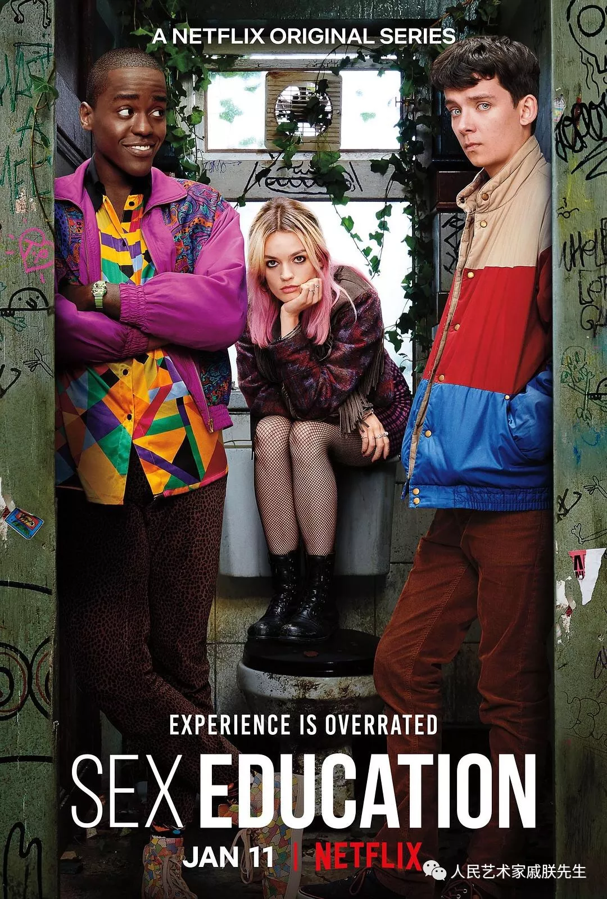
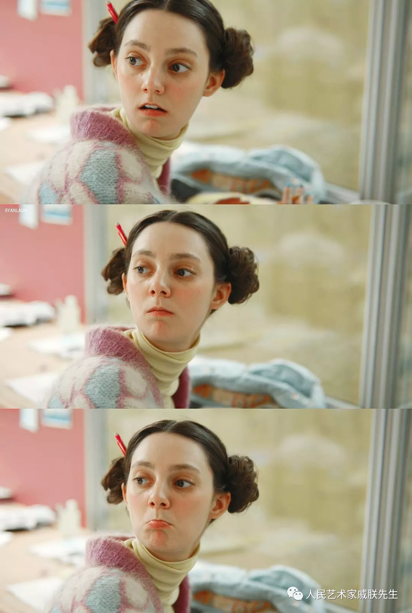
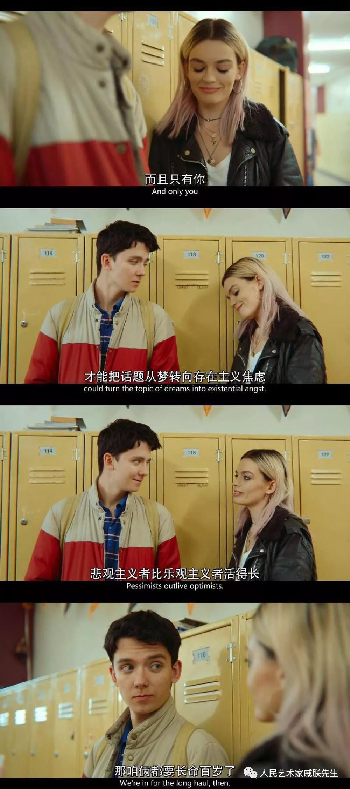
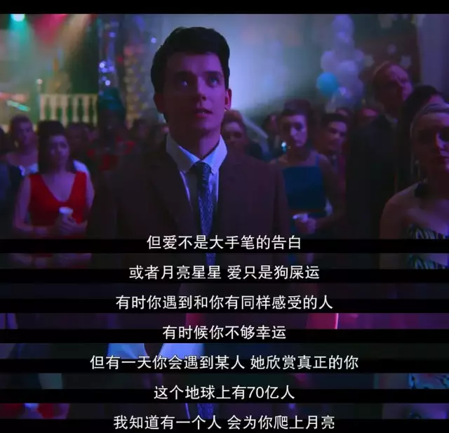
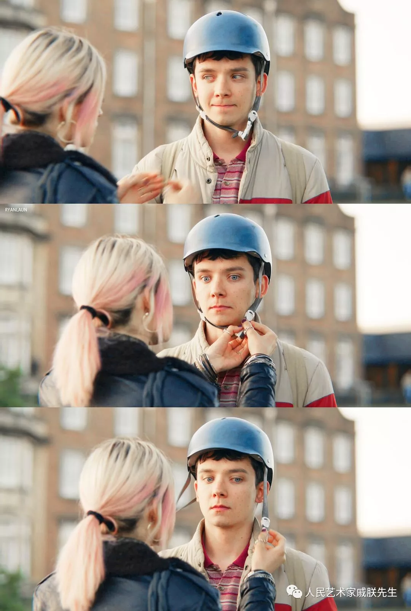

# 剧 性教育

    2019年作品 版权拥有：戚朕 未经授权不得转发

2019英美剧春季档依旧热闹，许多精彩的剧集随着春歇的结束而回归，更多等待完结的老剧马上就要开始，而鸽了很久的剧……仍然还没有消息。

那么在此，首先重点介绍下要推荐的剧[性爱自修室]

首先，这部剧不适宜在公共场所/实验室/教室观看!

故事梗概：男主（图右）来自于单亲家庭，母亲是一名性治疗师，耳濡目染的他拥有非常高深的姿势水平，在女主（图中）的攒动下开始在学校开展性相关的治疗工作，解决了一大批人难以启齿的床上问题。

与我国的填鸭应试教育不同，英美的中学拥有更加先进和自主化的教育体系，使得他们高中生拥有更加独立的思想和人格。兴趣课堂、论文实验、课后聚会、运动竞技等等主流的培养方式都是从独立决策的成人角度对待学生，在这种环境下，学校里受欢迎的人往往是肌肉发达的运动猛男和光彩夺目的啦啦队长，而苦心学术的书虫或者剑走偏锋的极客也能按自己的兴趣生活。

虽然这部片子中经常出现大量的18x镜头，但其实是对性这一人类最原始欲望的直白描述。国人成长过程中普遍存在的性教育缺失使得大部分人对其讳莫如深，剧中的学校课程会指导学生如何正确使用避孕套、校长可以公开讲话中提到女性的月经问题、以及整体环境对LGBT的正常对待，都反映出非常成熟的性观念。性行为作为个人自由意志的体现，在合法健康并合乎道德的条件下完全没有必要成为成长的束缚，由传统封建思想引发的压抑和打击总会引起不必要的误解甚至疾病。

在剧中，男主所诊疗的病症千奇百怪，既有对开关灯不满意的男女，也有体会不到感觉的拉拉，更有偏执臆想的单相思。而这些问题的症结，大多也回归到爱情本身这一经典的话题上，分析和沟通是治疗师的主要治疗手段，而认清自己和包容理解也是青春期问题少年的一般药方。

虽然剧名比较硬核，单由于建立在爱情的故事内核上，男主、女主、男二甚至男主妈妈的恋爱始终是故事情节的隐藏剧情线，虽然来自不同的国家和社会，但是爱情作为人类最朴质的情感，我们总能在他们的故事里感同身受。

另外，这部剧的配色也值得考究。阳光可爱的青少年，配合女主的发色、以及明朗轻快的背景，让人有种置身于青春期的每美妙快乐。整部剧的节奏轻快，有幽默的桥段，出人意料的反转以及对校园暴力的独特思考，在艺术价值和剧情表现上都可圈可点。

