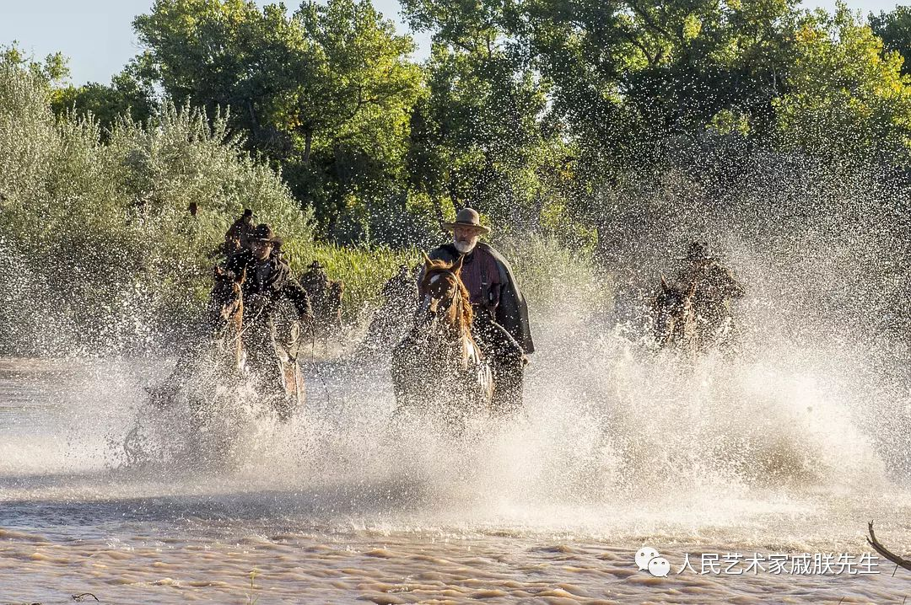
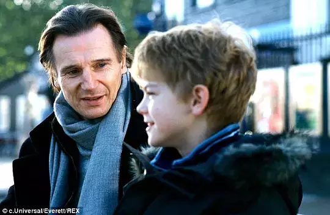
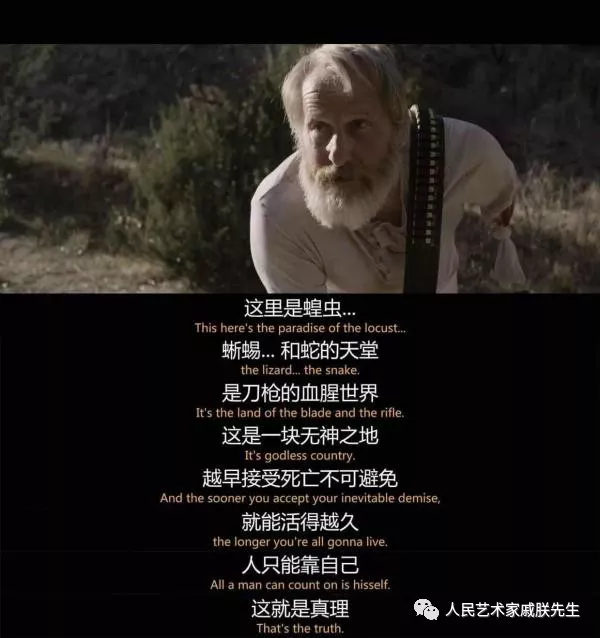
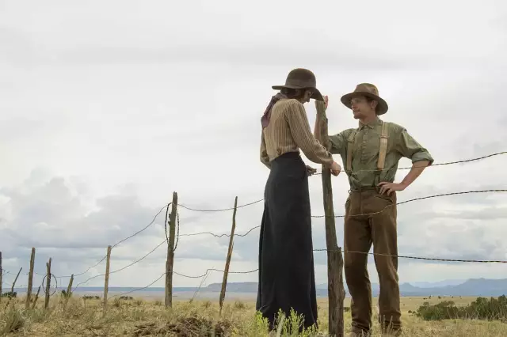
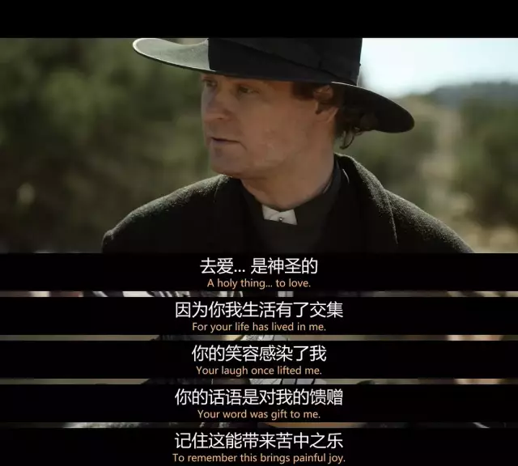

# 剧 无神

    2017年作品 版权拥有：戚朕 未经授权不得转发
    

说到美国的西部片，最近可能比较火的就是西部世界了，然而西部世界是一个架构在西部背景之下的AI主题科幻片，对19世纪西部的历史环境并没有什么特别的描述，今年Netflix推出了这个口碑炸裂的正派西部片，民风淳朴的牛仔生活和枪战动作场面描绘都很多很丰富。

豆瓣上这部剧的简介是：背景设定在19世纪80年代的美国西部地区，不法之徒Frank Griffin(丹尼尔斯饰)展开对他的前队友、后变为敌人的Roy Goode(奥康奈尔饰)的追捕行动。Roy隐藏在一座牧场之中，Frank的追捕引导他来到新墨西哥州的神秘小镇La Belle——全部居民均为女性。

可以简单总结为：**西部铁汉柔情之决战寡妇村**，这部片子里没有什么特别出名的演员：

唯一眼熟的就是最右边的小伙子，他曾经出演过权利的游戏（帮助布兰成为先知的那个）、真爱至上（下面这个）。

在这部剧里，他演的是一个小牛仔，担任了小镇的警长副手，年纪轻轻枪法了得，并且喜欢上了寡妇村旁边黑人村的黑小妞，作为一个独特的感情线十分俏皮可爱。

剧里面他还会一手帅气的掏枪摆弄动作，可惜我没找到动图，要我是那个年代的女生我看到这么用枪的肯定就爱上他了。 = .=

作为一部成功的美剧，它的内核不是只有枪战那么简单，感情线很充足，不光有男女之间，还有……对，男主和马的感情也十分充实，而且女权、黑人权利、以及印第安人在那个时代的特殊存在方式，都作为丰富剧情的方式并不尴尬地穿插进来，反派作为一个喜欢把自己标榜为牧师的人，说话也是非常有考究：

哦对，这里面还有个德国（裸体）行为主义女文青。

剧情很流畅，女主也很好看，非常激烈的大决战在最后才会出现，但不要着急，西部美景、适时的配乐、以及各种福利总会吸引你的。

