# 演员 西尔莎·罗南 Saoirse Ronan

    2018年作品 版权拥有：戚朕 未经授权不得转发
    
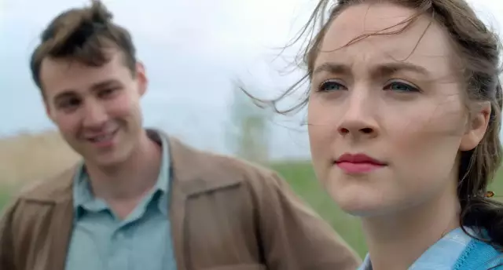

今年早些时候的第90届奥斯卡颁奖典礼上， 『伯德小姐』获得了包括最佳影片在内的很多提名，94年出生的主演西尔莎·罗南也凭借出色的演技提名最佳女主角（可惜没中）。

在的SNL（周六夜现场）上，罗南自己吐槽，自己名字Saoirse（在爱尔兰语中意为“自由”）看上去怎么也不应该发“西尔莎”这个音。

西尔莎·罗南的父母都是爱尔兰人，她出生在美国纽约并在爱尔兰长大，因此她能顺畅地在美式英语和爱尔兰英语之间切换，吐槽一下爱尔兰英语发音是真的逗比…具体的成长经历有她的一段自述：

虽然罗南94年出生，但是因为童星出道，出演的作品已经非常多，07年凯拉·奈特利（KK）和詹姆斯·麦卡沃伊（一美）主演的电影『赎罪』中，她出演了13岁时节的Briony Tallis，演技被KK高度称赞，后来又出演了『可爱的骨头』、『布达佩斯大饭店』、『布鲁克林』等等。

虽然罗南软妹长相，颜值颇高，但是却没有固步自封，多次奥斯卡提名、金球奖获奖使她的演技得到了客观证明。戏内认真负责甚至变换外表（有意增肥），戏外极其罕见的绯闻，对自己、尤其是台下对爱尔兰口音毫不避讳使得她成为新生代里合格的演员，可以说颜值与演技、性格俱佳了。

西尔莎·罗南的一些主要作品和饰演角色的剧照：

1.『赎罪』

『赎罪』（豆瓣8.2）是07年的电影，讲述了13岁的少女布里奥妮（西尔莎•罗南 饰）误以为表姐被仆人的儿子罗比强奸，而二者实际上是恋人关系，导致罗比入狱，出狱后罗比参军投入第二次世界大战，为国捐躯，相爱的两人最终阴阳相隔，布里奥妮长大后成为作家，最终鼓起勇气写书将事实公之于众，希望因此赎罪。

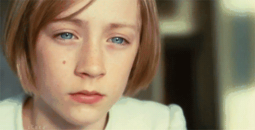

    小孩子版本的西尔莎•罗南

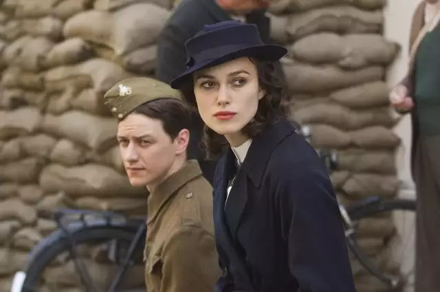

    两位主演：一美&KK

2.『可爱的骨头』

『可爱的骨头』（豆瓣7.1）是2009年改编自畅销书的电影，西尔莎•罗南饰演一个14岁的小女孩苏西，暗恋了一个英国学长，两个人在恋爱含苞待放的时候，苏西被坏人邻居诱骗，陷入圈套。

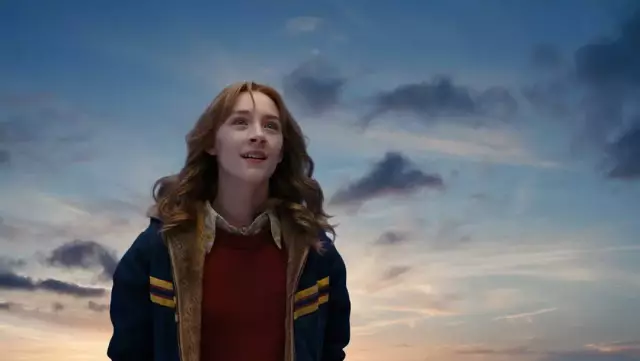

    青春少女版本的西尔莎•罗南

3. 『布达佩斯大饭店』

    『布达佩斯大饭店』（豆瓣8.8）（2014）讲述了著名的布达佩斯大饭店在第一次世界大战期间经历的风雨飘摇的往事。这部电影是豆瓣榜单Top250，剧情很轻快，画风极其优美，罗南扮演了一个小糕点师，对整个剧情起到了很关键的作用。

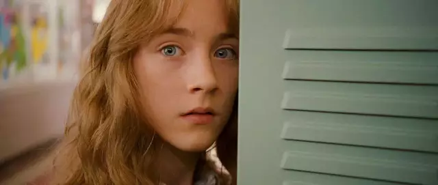

    糕点师版本的西尔莎•罗南

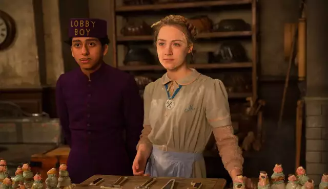
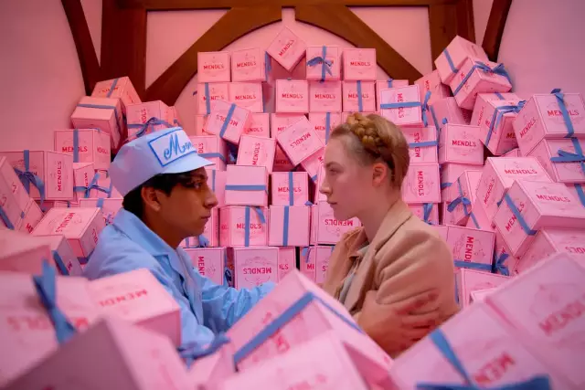
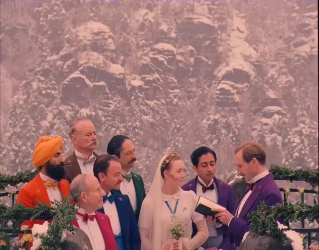

    极其舒服的配色

4.『布鲁克林』

2015年的电影『布鲁克林』（豆瓣7.8）简直是为西尔莎•罗南量身定做，讲述了一个爱尔兰女孩从祖国独身一人坐船到美国闯荡，经历了人生的诸多风雨最终独立自主，安身纽约。这一步电影西尔莎根据导演的要求，增重了许多以贴合原著，演技精湛，尤其和姐姐、家庭难舍难分的关系，看湿了我好几次。这也次罗南第一次获得奥斯卡提名的电影。

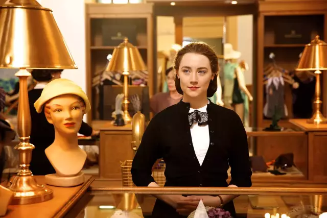

    成熟（肥胖）版本的西尔莎•罗南

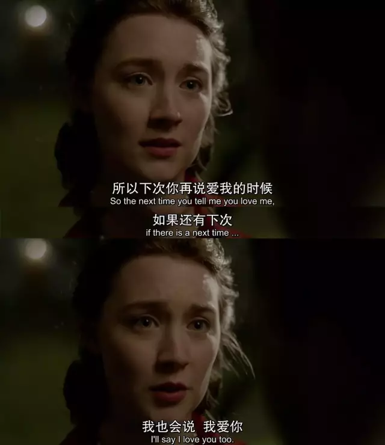

    男主傻白甜也很可爱

5.『伯德小姐』

2017年『伯德小姐』（豆瓣7.9）着眼于一个青春期少女的叛逆和困惑。西尔莎•罗南饰演一个由于搬家而到教会高中上学的女孩，执意叫自己Lady Bird，经历了友情、爱情和家庭的动荡，最终获得成长。电影本身偏重于对角色的塑造和引起观众的共鸣。这部电影获奖无数，包括奥斯卡提名和金球奖影后获奖。

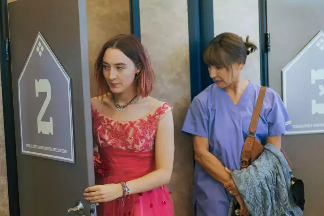

    叛逆版本的西尔莎•罗南

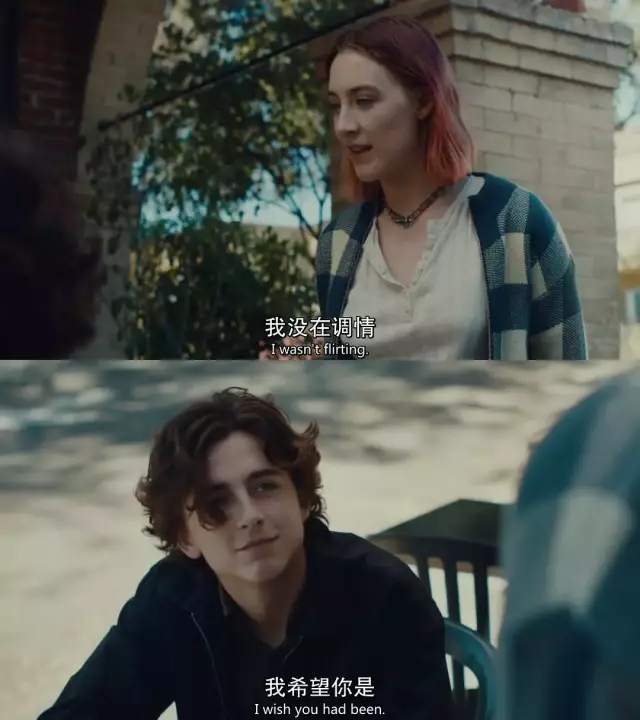

    甜茶的美貌

-1.『Galway Girl』

17年罗南出演了黄老板Ed Sheeran的『Galway Girl』MV，全程男友视角。

The End

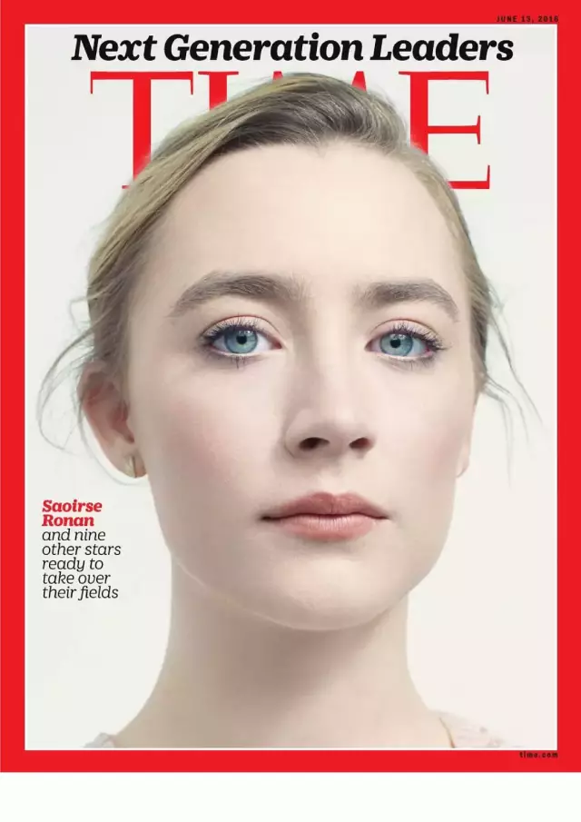
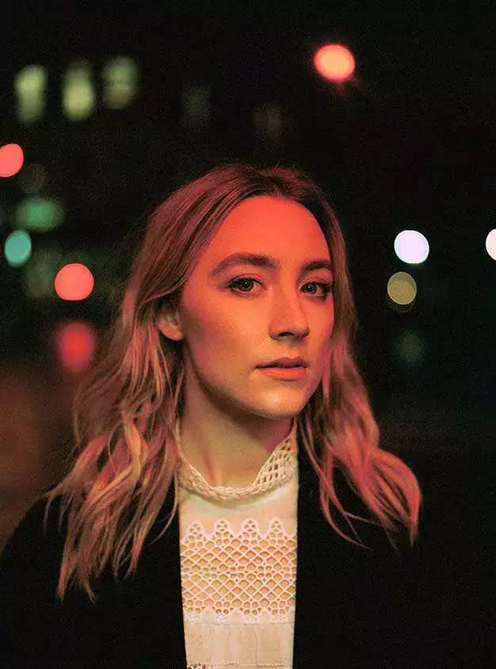

