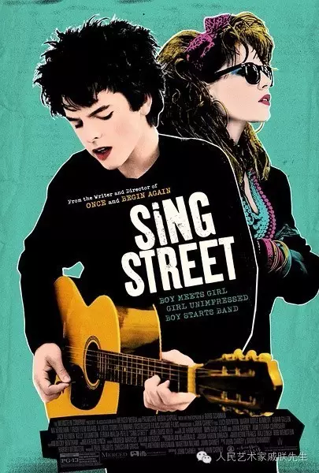

# 电影 唱街 Sing Street

    2016年作品 版权拥有：戚朕 未经授权不得转发
    

John Carney这个音乐人导演非常神奇，这个爱尔兰人以前是摇滚乐队的贝斯手，因为在乐队喜欢拍音乐录像后来当了导演，从2007年的Once到2013年的Begin Again再到2016年的Sing Street，看他的电影总是有种特别放心的感觉，因为电影的节奏一直清晰明快，电影的音乐肯定好听，不服的话戳下面这个Sing Street里的片段：

电影讲的是一个男孩从因为一个姑娘发从平庸的小窝囊变成乐队主唱酷Boy的故事，充斥着80年代摇滚乐的经典，但也包含着家庭成员之间的各种不一样的感情，虽然男女主人公之间的爱情才是主线索，但男主和哥哥的交流、父母的感情失败也不经意间成为影响他心理和行为的因素。

大陆的翻译是[初恋这首情歌]，至于是否会上映就不得而知了，但是估计上映也将是Begin Again那种网络资源已经泛滥的过时电影，去电影院二刷三刷总有种惊喜里的失落…

